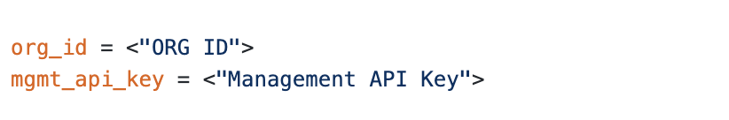
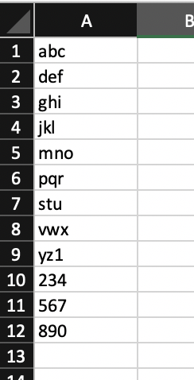
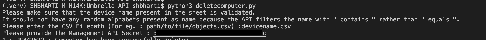
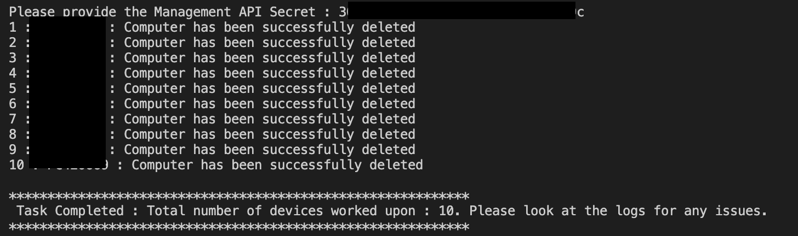

# UmbrellaBulkDeleteComputer
API workflow to delete set number of roaming computers provided through a CSV File. This script has been tested with Umbrella v1 Management APIs and requires Python 3 running on the end machine. 

Umbrella Management API does not provide BULK option by default and also has a rate limit in place as following.  

- 5 requests per second
- 14 requests per minute
- 350 requests per 30 minutes

When a rate limit is reached, the API returns the Too Many Requests error with the HTTP response code 429, for the remainder of the time-period.  The script has been written to not hit this rate limit as we are using a timer of 6 seconds per API requests. 

For more details about Management API : https://docs.umbrella.com/umbrella-api/docs/management-api-documentation

## Installation

Installing the script is pretty straight forward . You can just copy and paste them into you python environment but a good practice is to run them into a python virtual environment.

### Install a Python virtual environment

	For Linux/Mac 

	python3 -m venv venv
	source bin activate

	For Windows 
	
	We assume that you already have installed git-bash.  If so open a git-bash console and :

	python -m venv venv
	source /venv/Scripts/activate

### git clone the scripts

	git clone https://github.com/shubhambharti89/UmbrellaBulkDeleteComputer.git
	cd UmbrellaBulkDeleteComputer/
	
### install needed python modules

These scripts use the following python modules

- requests
- json
- csv
- time

You can install these modules with the following :

	pip install -r requirements.txt
	
## Running the scripts

First you need to make couple of changes that needs to be done on the script **main.py** before using it. Provide the following two details to the script :

- Organization ID 
- Management API Key

This workflow requires CSV File as an input - Sample CSV file is provided in this repository itself. Fill the CSV file with required roaming computer names and run **main.py** script present in respective folder. 

Once the required details are provided, the output is seen as below(This is just an example):

This script also provides you with a log file in the same folder with success and failure responses. The sample Success and Error logs are provided in the same repository

- ErrorLog.txt
- SuccessLog.txt

